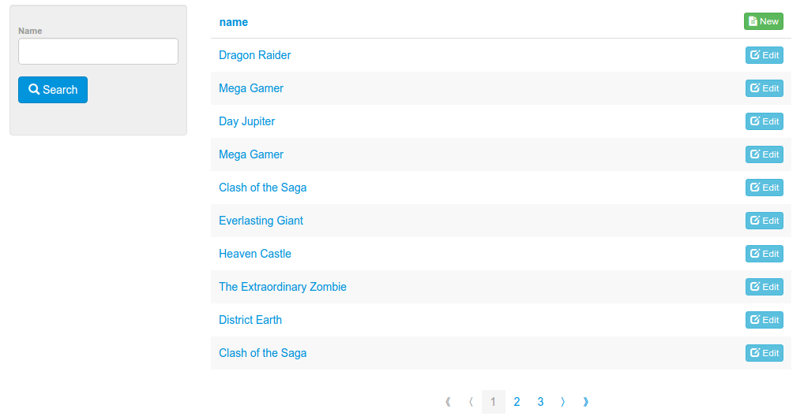
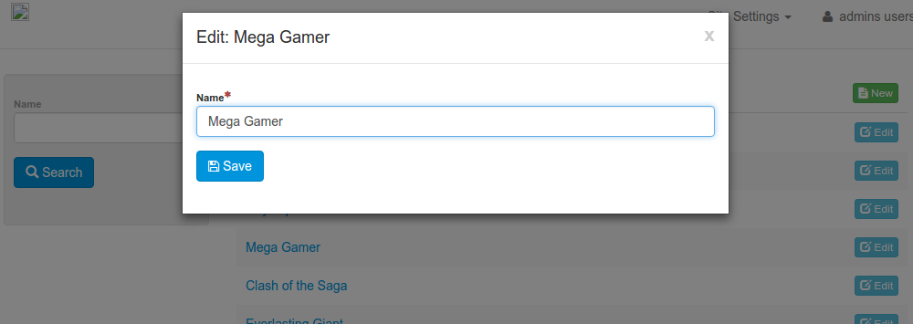

# Howto: CRUD, View and Search for your Entity Model

This guide will only take a few minutes. After completion, you will have produced:

- CRUD, View and Search services for your entity class
- The client-side UI to use them through any modern. 


## Contents

- [Service URLs and HTTP methods](#service-urls-and-http-methods)
    - [Create](#create)
    - [View](#view)
    - [Update](#update)
    - [Search](#search)
    - [Delete](#delete)
- [Create the Back-End](#create the-back-end)
    - [Entity](#entity)
    - [Repository](#repository)
    - [Service](#service)
    - [Controller](#controller)
    - [Initialize Sample Data](#initialize-sample-data)
- [Create the Front-End](#create-the-front-end)
    - [Create the Model](#create-the-model)
    - [Configure the Router](#configure-the-router)
    - [Test the Interface](#test-the-interface)
    - [Advanced Model Configuration](#advanced-model-configuration)
        - [Grid Schema](#grid-schema)
        - [Form Schemas](#form-schemas)

## Service URLs and HTTP methods

Calipso exposes CRUD, View and Search services for entity models in a regular way. Consider the RESTful URLs for an entity model representing a book. The <e>Entity URL Fragment</e> for that would be "books". Bellow are the service URLs for that EUF.

HTTP Method   | HTTP URL | Action
------------- | ---------|--------------
POST          | localhost:8080/calipso/books | [Create](#create)
GET           | localhost:8080/calipso/books/someId | [View](#view)
PUT           | localhost:8080/calipso/books/someId | [Update](#update)
GET           | localhost:8080/calipso/books?foo=bar&foo.subFoo=baz | [Search](#search)
DELETE        | localhost:8080/calipso/books/someId | [Delete](#delete)


### Create

```
POST http://localhost:8080/calipso/books
```

Create a new book using the request body and return it in the response.


### View

```
GET http://localhost:8080/calipso/books/someId
```

Find the book having "someId" as the id value and return it in the response. Throw an 404 HTTP error if no match is found.


### Update

```
PUT http://localhost:8080/calipso/books/someId
```

Update the book with id "someId" using the request body and return the result in the response. Partial updates are easily supported, just mark your Java entity class using <code>implements PartiallyUpdateable</code> to support partial updates. No actual implementation is needed. 


### Search

```
GET http://localhost:8080/calipso/books?foo=bar&foo.subFoo=baz
```

Get a paginated collection of all books matching the given criteria. No actual java implementation is required for your entity models, their properties are dynamically mapped to the HTTP parameters by the default. additionally, the following predefined parameters are supported:

Name       | Required | Default | Description
---------- | -------- | ------- | --------------
page       | false    | 0       | Page number starting from 0 (default)
size       | false    | 10      | Page size, default to 10
properties | false    | "id"    | Ordered list of comma-separeted property names used for sorting results. Default is "id"
direction  | false    | "ASC"   | Optional sort direction, either "ASC" or "DESC". Default is "ASC".


### Delete

```
DELETE http://localhost:8080/calipso/books/someId
```

Delete the book having "someId" as the id value.


## Create the Back-End

The back-end is composed by your actual entity class and some skeleton code. The latter is used to bootstrap the defaults for exposing RESTful services for your entity and provide ways to easily extend with more functionality if needed in any of the following tiers:

* Repository: Provides the persistence tier, supports relational databased via JPA and NoSQL stores like ElasticSearch and MongoDB 
* Service: Provides a tier for business logic
* Controller: Per MVC, provides the web tier through RESTful services


### Entity

You can implement your entity extending and/or implementing a number of base classes and/or interfaces related to ID type, auditing, metadata, partial  updates etc. For example the AbstractSystemUuidPersistable used bellow is a simple JPA @MappedSuperclass that provides a UUID primary key strategy.

```java
package gr.abiss.calipsoexample.model;

import gr.abiss.calipso.model.base.AbstractSystemUuidPersistable;
import javax.persistence.Column;
import javax.persistence.Entity;
import javax.persistence.Table;

@Entity
@Table(name = "book")
public class Book extends AbstractSystemUuidPersistable{
    
    @Column(length = 500, nullable = false)
    private String name;
    
    public Book() {
        super();
    }

    public String getName() {
        return name;
    }
    public void setName(String name) {
        this.name = name;
    }
}
```

### Repository

You can implement your repository just by extending the BaseRepository<T, ID> interface, with T and ID being the entity and class respectively. 

```java
package gr.abiss.calipsoexample.repository;

import gr.abiss.calipsoexample.model.Book;
import gr.abiss.calipso.jpasearch.repository.BaseRepository;

public interface BookRepository extends BaseRepository<Book, String> {
    // that's all!
}
```

### Service

A service requires both interface and implementation classes. However, no implementation code is actually required.

#### Service Interface

Just extend the GenericEntityService<T, ID> interface, with T and ID being the entity and class respectively. 

```java
package gr.abiss.calipsoexample.service;

import gr.abiss.calipsoexample.model.Book;
import gr.abiss.calipso.service.GenericEntityService;

public interface BookService extends GenericEntityService<Book, String> {

}
```

#### Service Implementation

```java
package gr.abiss.calipsoexample.service.impl;

import gr.abiss.calipso.service.impl.GenericEntityServiceImpl;
import javax.inject.Inject;
import javax.inject.Named;
import org.springframework.beans.factory.annotation.Qualifier;
import gr.abiss.calipsoexample.model.Book;
import gr.abiss.calipsoexample.repository.BookRepository;
import gr.abiss.calipsoexample.service.BookService;

@Named("bookService")
public class BookServiceImpl extends GenericEntityServiceImpl<Book, String, BookRepository> 
    implements BookService{
    
    @Override
    @Inject
    @Qualifier("bookRepository")
    public void setRepository(BookRepository repository) {
        super.setRepository(repository);
    }   
}
```
    
### Controller

Just extend the AbstractServiceBasedRestController<T, ID, S> interface, with T, ID and S being the entity, id and service classes respectively. 

*Note* the convention for the controller request mapping being  "/api/rest/books", with "books" being the Entity URL Fragment.

```java
package gr.abiss.calipsoexample.controller;

import gr.abiss.calipso.controller.AbstractServiceBasedRestController;

import javax.inject.Inject;
import org.springframework.beans.factory.annotation.Qualifier;
import org.springframework.stereotype.Controller;
import org.springframework.web.bind.annotation.RequestMapping;
import gr.abiss.calipsoexample.model.Book;
import gr.abiss.calipsoexample.service.BookService;


@Controller
@RequestMapping(value = "/api/rest/books", produces = { "application/json", "application/xml" })
public class BookController extends AbstractServiceBasedRestController<Book, String, BookService> {

    @Override
    @Inject
    @Qualifier("bookService")
    public void setService(BookService service) {
        this.service = service;
    } 
}

```

### Initialize Sample Data

```java
package gr.abiss.calipsoexample.init;

import gr.abiss.calipso.AppInitializer;

import javax.inject.Inject;
import javax.inject.Named;

import org.resthub.common.util.PostInitialize;

import gr.abiss.calipsoexample.model.Book;
import gr.abiss.calipsoexample.service.BookService;


@Named("bookerInitializer")
public class BookerInitializer extends AppInitializer {

    @Inject
    @Named("bookService")
    private BookService bookService;

    @PostInitialize
    public void init() {
        String[] titles = {"Clash of the Saga", "The 10th Game", 
                "Hell Mirror", "Everlasting Giant", "Mega Gamer", "Day Jupiter", 
                "District Revenge", "The Extraordinary Zombie", "Dragon Raider", 
                "Heaven Castle", "District Earth", "Heaven Shuttle"};
        //create the books
        for(String title : titles){
            Book book = new Book();
            book.setName(title);
            book = this.bookService.create(book);
        }
    };
}
```

## Create the Front-End
.
For the front implementation you only have to create and register a model type. The MVC route/URL is dynamic and conventional, so you don't need to define any. You also don't have to create any views etc. for your model type unless you want to override the defailt rendering strategies.


### Create the Model

Add a JS file for the model, e.g. src/main/webapp/js/model/BookModel.js:

```js
define([ 'calipso' ], function(Calipso) {
    var BookModel = Calipso.model.GenericModel.extend({},
    // static members
    {
        parent : Calipso.model.GenericModel,
        pathFragment : "books",
        typeName : "BookModel",
        layoutViewType : Calipso.view.ModelDrivenSearchLayout,
        getFormSchemas : function() {
            return {
                name : {
                    // use typeaghead-based autocomplete for search forms
                    "search" : {
                        name: "name",
                        type : Calipso.components.backboneform.Typeahead, //'Text'
                        typeaheadSource : {
                            displayKey : "name",
                            source: BookModel.getTypeaheadSource({query: "?name=%25wildcard%25"}),
                        }
                    },
                    "default" : {
                        name: "name",
                        type : 'Text',
                        validators : [ 'required' ]
                    }
                },
            };
        },
        getGridSchema : function() {
            return [ {
                name : "name",
                editable : false,
                cell : Calipso.components.backgrid.ViewRowCell
            }, {
                name : "edit",
                cell : Calipso.components.backgrid.EditRowInModalCell,
                headerCell : Calipso.components.backgrid.CreateNewInModalHeaderCell
            } ];
        }
    });
    return BookModel;
});

```

### Configure the Router

Add the following line in src/main/webapp/js/modules-config.js:

```js
    // Dont forget to import BookModel in define()
    Calipso.customModel[BookModel.getPathFragment()] = BookModel;
```


### Test the Interface

#### Search

Hit http://localhost:8080/eclipseexample/client/books?page=0&size=10



#### Create/Update




### Advanced Model Configuration

The following is a list of **static** model type members used to configure the UI. You can also override the static getter for each of the following if the declarative approach is not sufficient for your needs.

Static member | Description
-------------- | ---------|--
pathFragment   | The model type's <e>Entity URL Fragment</e>, e.gl "books", "users" etc.
typeName       | The model type as a string, e.g. "Calipso.model.GenericModel"
label          | A descriptive label, e.g. "generic model"
public         | Whether the routes arew public by default, default is false 
businessKey    |  The model identifier. The identifier may be either a primary or business key, depending on yourYou can override GenericModel.businessKey to define another property name.
layoutViewType | The LayoutView type for this model. The default is Calipso.view.ModelDrivenSearchLayout.
collectionViewType | The CollectionView type for this model. The default is Calipso.view.ModelDrivenCollectionGridView.
itemViewType   | The ItemView type for this model. The default is Calipso.view.GenericFormView.
reportViewType | The Report View type for this model. The default is Calipso.view.ModelDrivenReportView.
gridSchema     | See  <a href="#grid-schema">Grid Schema</a>. You may also override static or instance getGridSchema() instead.
formsSchema    | See  <a href="#form-schemas">Form Schemas</a>. You may also override static or instance getFormSchemas() instead.

#### Grid Schema

Grid schemas are based on [Backgridjs]:


```js
   // You may also override a model's static gridSchema property instead.
    getGridSchema : function() {
        return [ {
            name : "name",
            editable : false,
            cell : Calipso.components.backgrid.ViewRowCell
        }, {
            name : "edit",
            cell : Calipso.components.backgrid.EditRowInModalCell,
            headerCell : Calipso.components.backgrid.CreateNewInModalHeaderCell
        } ];
    }
```

#### Form Schemas

Form schemas are based on [Backbone Forms]. the main difference is that each field introduces schemas for multiple actions (search, create, update etc.). For example, consider the following backbone forms schema:

```js
    name : {
        name: "name",
        type : 'Text',
        validators : [ 'required' ]
    },
```

In calipso, the schema hierarchy is extended to cover multiple actions, for example a "default" and a "search" schema:

```js
    // You may also override a model's static or instance getFormSchemas() instead.
    formsSchema: {
        name : {
            "default" : {
                name: "name",
                type : "Text",
                validators : [ "required" ]
            },
            // use typeaghead-based autocomplete for search forms
            "search" : {
                name: "name",
                type : Calipso.components.backboneform.Typeahead, 
                typeaheadSource : {
                    displayKey : "name",
                    source: BookModel.getTypeaheadSource({query: "?name=%25wildcard%25"}),
                }
            },
        },
    }
```
    
[calipso-hub-framework]:calipso-hub-framework
[calipso-hub-utilities]:calipso-hub-utilities
[calipso-hub-webapp]:calipso-hub-webapp
[Backbone]:http://backbonejs.org
[Marionette]:http://marionettejs.com
[Bootstrap]:http://getbootstrap.com
[Backgridjs]:http://backgridjs.com
[Backbone Forms]:https://github.com/powmedia/backbone-forms
[RequireJS]:http://requirejs.org

    
